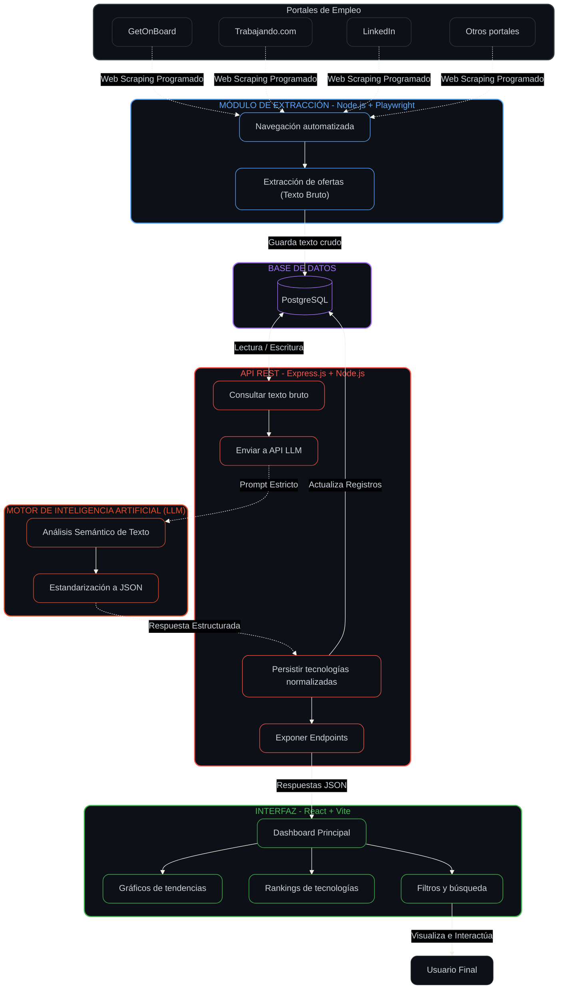

# 🇨🇱 ChileDev

ChileDev es una plataforma web originalmente construida para la [Muestra Tech](https://usm.cl/noticias/muestra-tech-usm-vuelve-y-proyecta-nueva-etapa-de-innovacion-estudiantil/) en su segunda versión 2026.

El proyecto está orientado a centralizar la información del mercado laboral tecnológico de Chile. Mediante procesos automatizados, el sistema es capaz de extraer, normalizar y analizar la información obtenida de diversas ofertas laborales publicadas en portales de empleo. 

El objetivo principal es brindar al estudiante, egresado o por egresar de carreras relacionadas a la industria tecnológica, un panorama general sobre: ¿Qué se está solicitando realmente en el mercado laboral? Ya sean tecnologías, lenguajes o frameworks, entre otros. Esto permite al usuario orientar su aprendizaje hacia herramientas que pueden aumentar sus posibilidades en el mercado y, así, tomar decisiones informadas sobre su desarrollo profesional.

## Casos de Uso y Justificación del Mercado

ChileDev resuelve la asimetría de información en el ecosistema TI extrayendo y analizando ofertas laborales reales. La plataforma entrega datos concretos sobre las tecnologías más solicitadas, promedios salariales por rol y modalidades de trabajo, beneficiando a tres actores principales:

* **Desarrolladores y Estudiantes:** Frente a un 8,9% de desocupación nacional ([INE, 2026](https://www.ine.gob.cl/docs/default-source/prensa-y-comunicacion/presentacion-empleo-efm-26_vf_comunicaciones.pdf)), permite a los profesionales enfocar su aprendizaje en las herramientas con mayor demanda real, facilitando su inserción en un sector con alta empleabilidad.

* **Reclutadores y RR.HH.:** Un 35,2% de las empresas no logra cubrir vacantes por falta de competencias técnicas específicas ([ENADEL, 2024](https://www.subtrab.gob.cl/wp-content/uploads/2025/08/Informe-de-resultados-ENADEL-2024-Region-Metropolitana.pdf)). La plataforma ayuda a los equipos de selección a observar las tendencias de la competencia (salarios, stack tecnológico, presencialidad) para ajustar sus propios procesos.

* **Empresas e Instituciones Educativas:** Con un déficit de 5.000 profesionales TI anuales ([ACTI, 2023](https://centrodeinnovacion.uc.cl/assets/uploads/2023/07/HR-TRANSFORMACION-DIGITAL_WEB.pdf)), los datos extraídos sirven para actualizar programas de formación y focalizar capacitaciones. Además, fomenta la inclusión al transparentar oportunidades en una industria donde la participación técnica femenina es de apenas 12% ([Ipsos, 2026](https://www.ipsos.com/sites/default/files/ct/publication/documents/2026-03/Informe-Publico-Estudio-Buenas-Practicas-Genero-Industria-TI-TDCh-Ipsos.pdf)).

Tal como informa ENADEL, uno de los principales factores de no contratación es la falta de competencias o habilidades técnicas requeridas. Si bien ChileDev no tiene por objetivo capacitar directamente a los usuarios en dichas habilidades, sí busca trazar la ruta a seguir y brindar las facilidades necesarias para orientar el aprendizaje hacia lo que el mercado realmente exige.

## Arquitecura y Flujo de Datos

```mermaid
%%{init: {'theme':'base', 'themeVariables': { 'darkMode':'true', 'background':'#0d1117', 'primaryColor':'#0d1117', 'primaryBorderColor':'#30363d', 'primaryTextColor':'#c9d1d9', 'secondaryColor':'#0d1117', 'secondaryBorderColor':'#30363d', 'secondaryTextColor':'#c9d1d9', 'tertiaryColor':'#0d1117', 'tertiaryBorderColor':'#30363d', 'tertiaryTextColor':'#c9d1d9'}}}%%
graph TB
    subgraph Portales["Portales de Empleo"]
        P1[GetOnBoard]
        P2[Trabajando.com]
        P3[LinkedIn]
        P4[Otros portales]
    end

    subgraph Scraper["MÓDULO DE EXTRACCIÓN - Node.js + Playwright"]
        S1[Navegación automatizada]
        S2["Extracción de ofertas (Texto Bruto)"]
        S1 --> S2
    end

    subgraph IA["MOTOR DE INTELIGENCIA ARTIFICIAL (LLM)"]
        I1["Análisis Semántico de Texto"]
        I2["Estandarización a JSON"]
        I1 --> I2
    end

    subgraph Database["BASE DE DATOS"]
        DB[(PostgreSQL)]
    end

    subgraph Backend["API REST - Express.js + Node.js"]
        B1[Consultar texto bruto]
        B2[Enviar a API LLM]
        B3[Persistir tecnologías normalizadas]
        B4[Exponer Endpoints]
        B1 --> B2
        B3 --> B4
    end

    subgraph Frontend["INTERFAZ - React + Vite"]
        F1[Dashboard Principal]
        F2[Gráficos de tendencias]
        F3[Rankings de tecnologías]
        F4[Filtros y búsqueda]
        F1 --> F2
        F1 --> F3
        F1 --> F4
    end

    User[Usuario Final]

    P1 & P2 & P3 & P4 -.->|Web Scraping Programado| S1
    S2 -->|Guarda texto crudo| DB
    DB <-->|Lectura / Escritura| B1
    B2 -.->|Prompt Estricto| I1
    I2 -.->|Respuesta Estructurada| B3
    B3 -->|Actualiza Registros| DB
    B4 -->|Respuestas JSON| F1
    F4 -->|Visualiza e Interactúa| User

    style Portales fill:#0d1117,stroke:#30363d,stroke-width:2px,color:#c9d1d9,rx:12,ry:12
    style Scraper fill:#0d1117,stroke:#58a6ff,stroke-width:2px,color:#58a6ff,rx:12,ry:12
    style IA fill:#0d1117,stroke:#e34c26,stroke-width:2px,color:#e34c26,rx:12,ry:12
    style Database fill:#0d1117,stroke:#a371f7,stroke-width:2px,color:#a371f7,rx:12,ry:12
    style Backend fill:#0d1117,stroke:#f85149,stroke-width:2px,color:#f85149,rx:12,ry:12
    style Frontend fill:#0d1117,stroke:#3fb950,stroke-width:2px,color:#3fb950,rx:12,ry:12
    style P1 fill:#0d1117,stroke:#30363d,stroke-width:1px,color:#c9d1d9,rx:12,ry:12
    style P2 fill:#0d1117,stroke:#30363d,stroke-width:1px,color:#c9d1d9,rx:12,ry:12
    style P3 fill:#0d1117,stroke:#30363d,stroke-width:1px,color:#c9d1d9,rx:12,ry:12
    style P4 fill:#0d1117,stroke:#30363d,stroke-width:1px,color:#c9d1d9,rx:12,ry:12
    style S1 fill:#0d1117,stroke:#58a6ff,stroke-width:1px,color:#c9d1d9,rx:12,ry:12
    style S2 fill:#0d1117,stroke:#58a6ff,stroke-width:1px,color:#c9d1d9,rx:12,ry:12
    style I1 fill:#0d1117,stroke:#e34c26,stroke-width:1px,color:#c9d1d9,rx:12,ry:12
    style I2 fill:#0d1117,stroke:#e34c26,stroke-width:1px,color:#c9d1d9,rx:12,ry:12
    style DB fill:#0d1117,stroke:#a371f7,stroke-width:1px,color:#c9d1d9,rx:12,ry:12
    style B1 fill:#0d1117,stroke:#f85149,stroke-width:1px,color:#c9d1d9,rx:12,ry:12
    style B2 fill:#0d1117,stroke:#f85149,stroke-width:1px,color:#c9d1d9,rx:12,ry:12
    style B3 fill:#0d1117,stroke:#f85149,stroke-width:1px,color:#c9d1d9,rx:12,ry:12
    style B4 fill:#0d1117,stroke:#f85149,stroke-width:1px,color:#c9d1d9,rx:12,ry:12
    style F1 fill:#0d1117,stroke:#3fb950,stroke-width:1px,color:#c9d1d9,rx:12,ry:12
    style F2 fill:#0d1117,stroke:#3fb950,stroke-width:1px,color:#c9d1d9,rx:12,12
    style F3 fill:#0d1117,stroke:#3fb950,stroke-width:1px,color:#c9d1d9,rx:12,ry:12
    style F4 fill:#0d1117,stroke:#3fb950,stroke-width:1px,color:#c9d1d9,rx:12,ry:12
    style User fill:#0d1117,stroke:#30363d,stroke-width:1px,color:#c9d1d9,rx:12,ry:12
```

**Ciclo de Vida de los Datos:**

1. **Extracción (Cron Job):** El módulo scraper basado en Playwright navega periódicamente por los portales de empleo configurados, extrayendo la información bruta de las descripciones de cargo y almacenando este texto en la base de datos relacional.
2. **Normalización Semántica (LLM):** El backend consulta el texto bruto almacenado y lo envía a un Modelo de Lenguaje Grande (LLM) mediante un prompt estricto. La IA analiza el contexto, estandariza las tecnologías (evitando duplicidades por sintaxis) y retorna un objeto JSON estructurado.
3. **Persistencia y Procesamiento:** El backend recibe el JSON, actualiza los registros en PostgreSQL con las tecnologías oficiales detectadas y calcula las frecuencias y promedios en tiempo real.
4. **Consumo Frontend:** La interfaz desarrollada en React consume la API, renderizando dashboards interactivos que permiten al usuario final filtrar y analizar el estado del mercado laboral con datos totalmente normalizados.
