# 🇨🇱 ChileDev

### 쯈ue es?

La respuesta a la duda; 쯈ue tecnologia esta sonando ahora en el mercado?. ChileDev es una web donde a través de webscraping se obtiene información de las ofertas laborales publicadas en portales de empleo en Chile.

### 쯈ue información entrega?

A través del webscraping se obtiene la siguiente información:

- Lenguajes de programación más solicitados.
- Frameworks más solicitados.
- Herramientas más solicitadas.
- Cantidad de ofertas laborales publicadas.
- Promedio salarial por tecnología.
- Gráficos de tendencias por tecnología.

### 쮺칩mo se hace?

Basicamente scrapeando portales de empleo en Chile, filtramos a traves de palabras claves las ofertas laborales y obtenemos la información relevante para luego ser procesada y mostrada en la web.

### 쮺on que tecnologías se hizo?

Para el frontend se utilizo React con Vite.
Para el backend se utilizo Laravel con PHP.
Para el webscraping se utilizo Playwright con Node.js.
Para la base de datos se utilizo PostgreSQL.

### 쯇ara que seria util?

Inicialmente este es un proyecto para aprender las tecnologias mencionadas anteriormente, pero puede ser util para:

- Desarrolladores que quieran saber que tecnologias estan siendo mas solicitadas en el mercado laboral chileno y asi aprenderlas.
- Reclutadores que quieran conocer las tendencias del mercado laboral en tecnologia.
- Empresas que quieran conocer que tecnologias deberian considerar para sus proyectos futuros.
- Personas que quieran cambiarse de tecnologia y quieran saber cuales son las mas demandadas.
- Cualquier persona interesada en el mercado laboral de tecnologia en Chile.

### 쯇orque Open Source?

No me importa el dinero, solo queria aprender estas tecnologias mientras me quiebro la cabeza haciendl algo bacan. Ademas de quitarme la duda de que tecnologias estan sonando en el mercado laboral chileno.

**Te recuerdo que el proyecto tiene licencia MIT y fue concebido porque simplmente queria aprender estas tecnologias a la vez que construyo algo util y con sentido.**

### 쮼s complejo el proyecto?

El proyecto tiene varias partes que interactuan entre si, pero cada una de ellas es relativamente sencilla de entender por separado. La complejidad radica en la integración de todas las partes para que funcionen correctamente juntas.

### 쮺omo funciona?

```mermaid
%%{init: {'theme':'base', 'themeVariables': { 'darkMode':'true', 'background':'#0d1117', 'primaryColor':'#0d1117', 'primaryBorderColor':'#30363d', 'primaryTextColor':'#c9d1d9', 'secondaryColor':'#0d1117', 'secondaryBorderColor':'#30363d', 'secondaryTextColor':'#c9d1d9', 'tertiaryColor':'#0d1117', 'tertiaryBorderColor':'#30363d', 'tertiaryTextColor':'#c9d1d9'}}}%%
graph TB
    subgraph Portales["Portales de Empleo"]
        P1[GetOnBoard]
        P2[Trabajando.com]
        P3[LinkedIn]
        P4[Otros portales]
    end

    subgraph Scraper["SCRAPER - Node.js + Playwright"]
        S1[Navegar portales]
        S2[Extraer ofertas]
        S3[Identificar tecnologías]
        S4[Recopilar salarios]
        S1 --> S2 --> S3 --> S4
    end

    subgraph Database["BASE DE DATOS"]
        DB[(PostgreSQL)]
    end

    subgraph Backend["BACKEND - Laravel PHP"]
        B1[Recibir datos]
        B2[Procesar información]
        B3[Calcular estadísticas]
        B4[API REST Endpoints]
        B1 --> B2 --> B3 --> B4
    end

    subgraph Frontend["FRONTEND - React + Vite"]
        F1[Dashboard]
        F2[Gráficos de tendencias]
        F3[Rankings tecnologías]
        F4[Filtros y búsqueda]
        F1 --> F2
        F1 --> F3
        F1 --> F4
    end

    User[Usuario]

    P1 & P2 & P3 & P4 -.->|scraping| S1
    S4 -->|Guarda datos| DB
    DB <-->|Query/Insert| B1
    B4 -->|JSON Response| F1
    F4 -->|Visualiza| User

    style Portales fill:#0d1117,stroke:#30363d,stroke-width:2px,color:#c9d1d9,rx:12,ry:12
    style Scraper fill:#0d1117,stroke:#58a6ff,stroke-width:2px,color:#58a6ff,rx:12,ry:12
    style Database fill:#0d1117,stroke:#a371f7,stroke-width:2px,color:#a371f7,rx:12,ry:12
    style Backend fill:#0d1117,stroke:#f85149,stroke-width:2px,color:#f85149,rx:12,ry:12
    style Frontend fill:#0d1117,stroke:#3fb950,stroke-width:2px,color:#3fb950,rx:12,ry:12
    style P1 fill:#0d1117,stroke:#30363d,stroke-width:1px,color:#c9d1d9,rx:12,ry:12
    style P2 fill:#0d1117,stroke:#30363d,stroke-width:1px,color:#c9d1d9,rx:12,ry:12
    style P3 fill:#0d1117,stroke:#30363d,stroke-width:1px,color:#c9d1d9,rx:12,ry:12
    style P4 fill:#0d1117,stroke:#30363d,stroke-width:1px,color:#c9d1d9,rx:12,ry:12
    style S1 fill:#0d1117,stroke:#58a6ff,stroke-width:1px,color:#c9d1d9,rx:12,ry:12
    style S2 fill:#0d1117,stroke:#58a6ff,stroke-width:1px,color:#c9d1d9,rx:12,ry:12
    style S3 fill:#0d1117,stroke:#58a6ff,stroke-width:1px,color:#c9d1d9,rx:12,ry:12
    style S4 fill:#0d1117,stroke:#58a6ff,stroke-width:1px,color:#c9d1d9,rx:12,ry:12
    style DB fill:#0d1117,stroke:#a371f7,stroke-width:1px,color:#c9d1d9,rx:12,ry:12
    style B1 fill:#0d1117,stroke:#f85149,stroke-width:1px,color:#c9d1d9,rx:12,ry:12
    style B2 fill:#0d1117,stroke:#f85149,stroke-width:1px,color:#c9d1d9,rx:12,ry:12
    style B3 fill:#0d1117,stroke:#f85149,stroke-width:1px,color:#c9d1d9,rx:12,ry:12
    style B4 fill:#0d1117,stroke:#f85149,stroke-width:1px,color:#c9d1d9,rx:12,ry:12
    style F1 fill:#0d1117,stroke:#3fb950,stroke-width:1px,color:#c9d1d9,rx:12,ry:12
    style F2 fill:#0d1117,stroke:#3fb950,stroke-width:1px,color:#c9d1d9,rx:12,12
    style F3 fill:#0d1117,stroke:#3fb950,stroke-width:1px,color:#c9d1d9,rx:12,ry:12
    style F4 fill:#0d1117,stroke:#3fb950,stroke-width:1px,color:#c9d1d9,rx:12,ry:12
    style User fill:#0d1117,stroke:#30363d,stroke-width:1px,color:#c9d1d9,rx:12,ry:12
```

**Flujo de datos:**

1. El scraper navega los portales de empleo cada X horas
2. Los datos extraídos se almacenan en PostgreSQL
3. El backend procesa y expone los datos via API REST
4. El frontend consume la API y muestra visualizaciones interactivas al usuario
